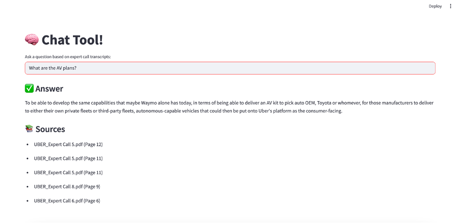

# 🧠 Transcript Chat Tool 

A lightweight, offline Q&A tool that lets you ask natural-language questions about Uber based on expert call transcripts. It uses semantic search (FAISS) and a locally running LLM (like Mistral or Phi-2 via `llama-cpp-python`) to retrieve relevant context and generate accurate, source-cited answers—all fully offline.

---

## Features

- Ask questions about Uber's AV strategy, logistics, delivery ops, labor trends, and more
- Uses local LLMs (e.g., Mistral 7B, Phi-2) via `llama-cpp-python`
- Retrieves only relevant expert transcript chunks with FAISS + sentence-transformers
- Fully offline — no internet, no API keys, no cloud dependencies
- Designed for non-technical users with a simple Streamlit interface

---

## System Requirements

- macOS/Linux/Windows
- Python 3.9+
- 64 GB RAM (recommended), 12 GB VRAM
- No internet required after initial setup

---

## Setup Instructions

### Step 1: Clone the Repo

```bash
git clone https://github.com/YOUR_USERNAME/uber-qa-offline.git
cd uber-qa-offline
```

### Step 2: Install Dependencies
```bash
pip install -r requirements.txt
```

### Step 3: Prep Files
- Place your expert transcript PDFs inside a folder named Q2/
```bash
mkdir models
wget -P models https://huggingface.co/TheBloke/phi-2-GGUF/resolve/main/phi-2.Q4_K_M.gguf
```

### Step 4: Build Search Index
```bash
python3 build_index.py
```

### Step 5: Run Streamlit App
```bash
streamlit run qa_app.py
```



